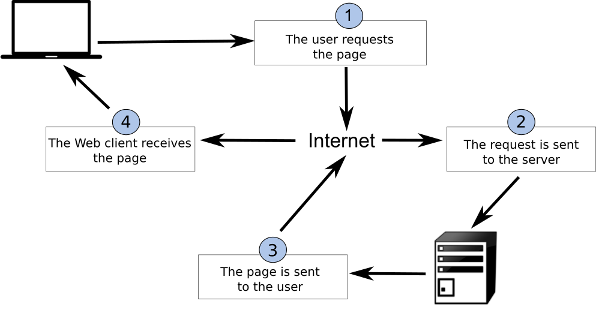
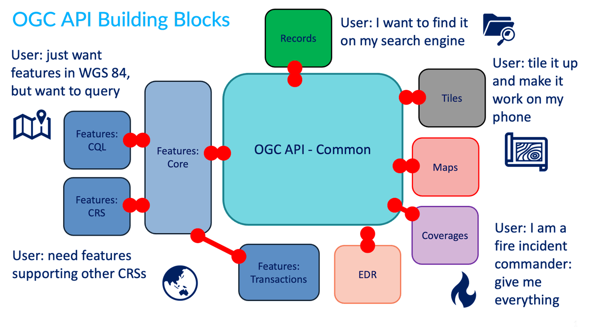

# Overview and main concepts

The core of Web APIs can be summarized as:

- interfaces: the way in which "conversations" happen between APIs and clients of them
- encodings: the "formats" of contents provided by an API

## Client / server

In a typical client / server environment, a client is asking a server to perform an action (for
example, requesting data), with the ability to add additional instructions such as querying, filtering
and what format for the API to provide as part of the response.

The image below, taken from [Introduction to GIS](https://volaya.github.io/gis-book/en/) illustrates
the concept of the request / response lifecycle between a client and a server.

{width="80.0%"}

## Web architecture

### REST

REpresentational State Transfer (REST) is an architectural style for the Web.  The core concepts of REST are:

- HTTP verbs (GET/PUT/POST/DELETE)
- HTTP codes (200, 201, 404, etc.)
- URIs to identify resources
- Content negotiation (media types)
- Stateless

Implementing REST results in a simpler, low barrier architecture that is based on web primitives.  This enables systems
and applications to focus more on domain/business requirements.

!!! note "Know your HTTP!"
    - verbs: <https://http.dev/methods>
    - status codes: <https://http.dev/status>

### JSON

JSON (JavaScript Object Notation) is a compact and very easy to understand encoding, which is very popular among
web developers.  JSON is the primary encoding used in RESTful web services and APIs, and is by nature extensible.

Let's compare JSON and XML in a simple example:

An example XML document (75 bytes):

```xml
<order>
    <orderID>123</orderId>
    <status>completed</status>
</order>
```

The same document as JSON (46 bytes):

```json
{
  "orderID": 123,
  "status": "completed"
}
```

Here, we see a more compact representation using JSON.  In addition, it is easier to determine the underlying data
type literals (integers, strings, etc.) by parsing the document itself.

!!! note JSON Schema
    [JSON Schema](https://json-schema.org) is the JSON equivalent to W3C XML Schema, providing a language to define the content model of
    a JSON document.  A JSON document can choose to implement a JSON Schema, or not, depending on a given application's requirements
    for data validation and integrity

## OGC APIs

This section provides a high level overview of OGC API standards support.

### Standards

Open standards allow for broad interoperability and plug and play capability.

### API standards

#### OGC API

!!! cite

    The OGC API family of standards are being developed to make it easy for anyone to provide geospatial data to the web. These standards build upon the legacy of the OGC Web Service standards (WMS, WFS, WCS, WPS, etc.), but define resource-centric APIs that take advantage of modern web development practices. This web page provides information on these standards in a consolidated location.

    These standards are being constructed as "building blocks" that can be used to assemble novel APIs for web access to geospatial content. The building blocks are defined not only by the requirements of the specific standards, but also through interoperability prototyping and testing in OGC's Innovation Program. 

#### OGC API - Common

[OGC API - Common](https://ogcapi.ogc.org/common/) is a common framework used in all OGC API's. 
OGC API - Common provides the following functionality:

- based on [OpenAPI 3.0](https://spec.openapis.org/oas/latest.html)
- HTML and JSON as the dominant encodings, alternative encodings are possible
- common and shared endpoints such as:
    - `/` (landing page)
    - `/conformance`
    - `/openapi`
    - `/collections`
    - `/collections/foo`
- common aspects such as pagination, links between resources, basic filtering, query parameters (`bbox`, `datetime`, etc.)

OGC API - Common allows for specification developers to focus on the key functionality of a given API (i.e. data access, etc.)
while using common constructs. This harmonizes OGC API standards and enables deeper integration with less code. This also
allows for OGC API client software to be more streamlined.

For more details about this standard, please refer to the [OGC API - Common section](https://ogcapi-workshop.ogc.org/api-deep-dive/common/).

#### OGC API building blocks

The OGC API approach allows for modularity and "profiling" of APIs depending on your requirements.  This means you
can mix and match OGC APIs together.



You can read more about this topic in the [building blocks website](https://opengeospatial.github.io/bblocks/).

#### More OGC APIs

The OGC API effort is rapidly evolving. Numerous OGC API standards are in development:

- [Maps](https://ogcapi.ogc.org/maps) can serve spatially referenced and dynamically rendered map imagery
- [Routes](https://ogcapi.ogc.org/routes) provides access to routing data
- [Styles](https://ogcapi.ogc.org/styles) defines a Web API that enables map servers, clients as well as visual style editors, to manage and fetch styles
- [3D GeoVolumes](https://ogcapi.ogc.org/geovolumes) facilitates efficient discovery of and access to 3D content in multiple formats based on a space-centric perspective
- [Moving Features](https://ogcapi.ogc.org/movingfeatures) defines an API that provides access to data representing features that move as rigid bodies
- [Joins](https://ogcapi.ogc.org/joins)  supports the joining of data, from multiple sources, with feature collections or directly with other input files
- [Discrete Global Grid System](https://ogcapi.ogc.org/dggs) enables applications to organise and access data arranged according to a Discrete Global Grid System (DGGS)
- [Connected Systems](https://ogcapi.ogc.org/connectedsystems/) is intended to act as a bridge between static data (geographic and other domain features) and dynamic data (observations of these feature properties, and commands/actuations that change these feature properties)


#### OpenAPI

Core to OGC API - Common is the [OpenAPI initiative](https://www.openapis.org/about) to help
describe and document an API. OpenAPI defines its structure in an OpenAPI document. 
OGC API - Common suggests this document to be located at `/openapi`. For example, with [pygeoapi](https://pygeoapi.io) in a browser 
[this URL](https://demo.pygeoapi.io/master/openapi) opens an interactive HTML page which facilitates 
an API query. Append `?f=json` to view the document in JSON. The OpenAPI document indicates which
endpoints are available in the service, which parameters it accepts and 
what types of responses can be expected. The OpenAPI document is a similar concept to Capabilities
XML as part of the first generation OGC Web Service standards.

!!! question "OpenAPI Specification parsing in a browser" 

    A common approach to interact with Open API's using json is to use a program like 
    [Postman](https://www.postman.com/). Also there are browser plugins which enable to define api 
    requests interactively within a browser. For firefox download the plugin 
    [poster](https://pluginsaddonsextensions.com/mozilla-firefox/poster-mozilla-addon). For Chrome 
    and Edge use [Boomerang](https://microsoftedge.microsoft.com/addons/detail/boomerang-soap-rest-c/bhmdjpobkcdcompmlhiigoidknlgghfo?hl=en-US). 
    In Boomerang you can create individual web requests, but also load the open api specification 
    document and interact with any of the advertised endpoints. 

The OpenAPI community provides various tools, such as a validator for OAS documents or 
[generate code](https://swagger.io/tools/swagger-codegen/) as a starting point for client development.

## Content and format standards

OGC APIs are typically format agnostic for data.  This means an OGC API can provide any format of data
or metadata (JSON, YAML, XML, HTML, etc.).

JSON is a core format that is machine readable and easy to parse and handle
by client software and tools.  JSON is easily decoded/encoded into native objects in numerous
programming languages (Python dictionaries, JavaScript objects, etc.).  OGC API - Common provides
uniform JSON formats for the various endpoints it supports.

Specific OGC API standards may specify domain specific formats (for example,
GeoJSON for OGC API - Features, GeoTIFF for OGC API - Coverages, ISO 19115/19139 for OGC API - Records, etc.),
depending on the data or metadata type(s).

## Summary

OGC APIs leverage core principles of Web architecture, providing support for discovery, access, visualization, processing
of geospatial data, in alignment with industry standards for maximum interoperability on the Web.
