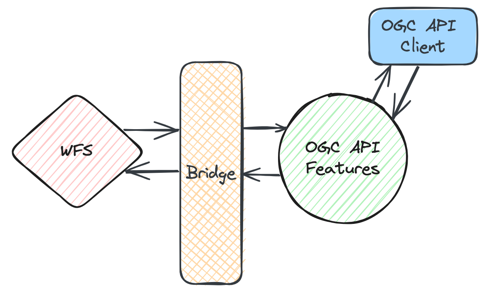

# Transition and migration

According to the [OGC Technical Committee Policies and Procedures](https://docs.ogc.org/pol/05-020r29/05-020r29.html), if an existing Standard is replaced in part or whole by one or more new Standards, then a special case of deprecation may occur resulting in the original Standard being labeled a "Legacy Standard." 

This could be the case of many [OWS standards](https://developer.ogc.org/ows.html), as they are replaced by more modern and more complete OGC APIs.

As with deprecated Standards, Legacy Standards are no longer supported, but they remain on the OGC website with a notification that the capabilities of the Standard have been replaced in whole or part by new Standard(s). The notification will clearly indicate that the Legacy Standard is not invalid, but that new implementations of the capabilities of the Standard are better served by the identified new Standard(s).

In the [Diving into pygeoapi Workshop](https://dive.pygeoapi.io), you can find a section about the [use of bridges to facilitate the migration from OWS to OGC API](https://dive.pygeoapi.io/advanced/bridges/).

{width="80.0%"}
